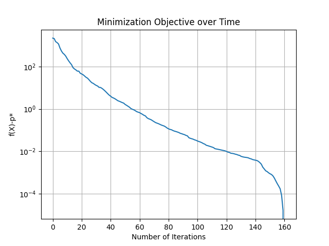

# Multiway Matching on the Multinomial Manifold

## Overview

* Implementation of conjugate gradient on the multinomial manifold for multiway matching. 
* For an intro to the multinomial manifold and its application to multiway matching, please see our corresponindg [ICRA 2020 paper](paper/LeonardosMultiwayICRA2020.pdf).
* The Willow Motorbike dataset can be downloaded from [here](https://www.di.ens.fr/willow/research/graphlearning/).  

## Prerequisites
* numpy
* matplotlib
* scipy

## Command line script

* General invocation:
```
usage: multiway.py [-h] [--dataset DATASET] [--solver SOLVER] [--i I]
                   [--lr LR] [--tol TOL] [--n N] [--k K] [--o O]

optional arguments:
  -h, --help         show this help message and exit
  --dataset DATASET  Dataset option: either 'Willow' (Motorbikes) or 'synthetic' are supported
  --solver SOLVER    Solver option: either 'cgd' for conjugate gradient or 'gd' for gradient descent
  --i I              Maximum number of iterations, default to 500
  --lr LR            Learning rate for gradient descent, default to 0.05
  --tol TOL          Convergence parameter, default to 1e-3.
  --n N              Number of images for creating the synthetic dataset
  --k K              Universe size for creating the synthetic dataset
  --o O              Outlier rate for creating the synthetic dataset
```

* Sample invocation 1:
```bash
python3 multiway.py --dataset Willow --solver cg --tol 1e-3
```
* Sample invocation 2:
```bash
python3 multiway.py --dataset synthetic --solver gd --tol 1e-3 --n 10 --k 20 --o 0.3
```

## Results on the Willow motorbikes dataset

* Starting from a random point on the multinomial manifold, we achieve 95.16% matching accuracy on the Willow Motorbike dataset with conjugate gradient which converges after 150 to 160 iterations: 
```
Conjugate gradient, iteration number 0 with cost 3587.7674
Conjugate gradient, iteration number 10 with cost 1696.5991
Conjugate gradient, iteration number 20 with cost 1553.5061
.
.
.
Conjugate gradient, iteration number 130 with cost 1512.5798
Conjugate gradient, iteration number 140 with cost 1512.5779
Conjugate gradient, iteration number 150 with cost 1512.5750

Initial accuracy: 72.26%
Accuracy after optimization: 95.16%
```



## Citation

* In case you use this code in your research please cite:
  ```
  @inproceedings{leonardos2020low,
    title={A Low-Rank Matrix Approximation Approach to Multiway Matching with Applications in Multi-Sensory Data Association},
    author={Leonardos, Spyridon and Zhou, Xiaowei and Daniilidis, Kostas},
    booktitle={2020 IEEE International Conference on Robotics and Automation (ICRA)},
    pages={8665--8671},
    year={2020},
    organization={IEEE}
  }
  ```
  
## Contact 
  
* Feel free to reach out to `spyridon10@gmail.com` with any questions or comments. 
